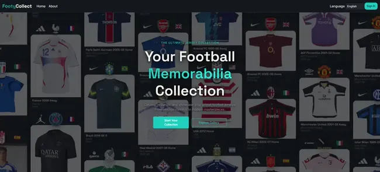
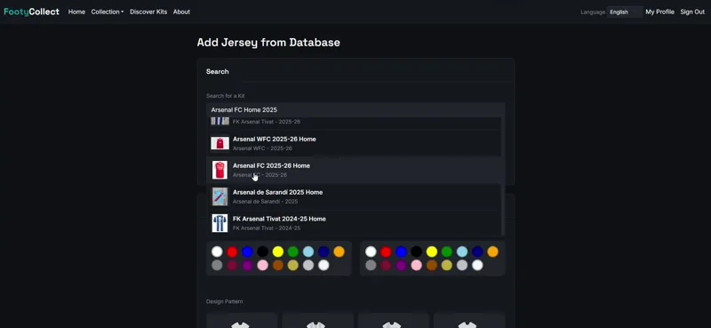

<h1 align="center">
    <picture>
        <source media="(prefers-color-scheme: light)" srcset="media/light_logo_footy_collect.svg">
        <source media="(prefers-color-scheme: dark)" srcset="media/main_logo_footy_collect.svg">
        
    </picture>
</h1>
<p align="center">
    <br>
    <a href="https://github.com/astral-sh/ruff"></a>
    <a href="https://codecov.io/gh/sunr4y/FootyCollect"></a>
    <br><br>
    <a href="https://sonarcloud.io/summary/new_code?id=sunr4y_FootyCollect"></a>
    <a href="https://sonarcloud.io/summary/new_code?id=sunr4y_FootyCollect"></a>
    <a href="https://sonarcloud.io/summary/new_code?id=sunr4y_FootyCollect"></a>
    <a href="https://sonarcloud.io/summary/new_code?id=sunr4y_FootyCollect"></a>
    <a href="https://sonarcloud.io/summary/new_code?id=sunr4y_FootyCollect"></a>
    <a href="https://sonarcloud.io/summary/new_code?id=sunr4y_FootyCollect"></a>
    <a href="https://sonarcloud.io/summary/new_code?id=sunr4y_FootyCollect"></a>
</p>

A Django-based web application for managing your football memorabilia collection. It integrates with the **Football Kit Archive** via [FKAPI](https://github.com/sunr4y/fkapi) to search and add kits by club, season, and competition—making FKAPI central to discovering and cataloguing items in your collection.

**License**: MIT

## Table of Contents

- [Live Demo](#live-demo)
- [Overview](#overview)
- [Architecture](#architecture)
- [Quick Start](#quick-start)
- [Development](#development)
- [API Documentation](#api-documentation)
- [Testing](#testing)
- [Deployment](#deployment)
- [Documentation](#documentation)

## Live Demo

Try FootyCollect without installing anything: **[https://footycollect-demo.sunr4y.dev/](https://footycollect-demo.sunr4y.dev/)**

<p align="center">
  
</p>

| Feature | Description |
|---------|-------------|
| **Registration** | Disabled. Use the demo account: sign in with the pre-configured demo user (auto-login or use the demo credentials shown on the site). |
| **Safe to experiment** | Create, edit, and delete items and photos as you like—the database is restored from a snapshot every 3 hours, so no changes are permanent. |

## Overview

FootyCollect is a comprehensive platform for football memorabilia collectors to catalog, organize, and manage their collections. The application supports various item types including jerseys, shorts, outerwear, and tracksuits.

**FKAPI and the Football Kit Archive.** FootyCollect uses [FKAPI](https://github.com/sunr4y/fkapi) (Football Kit Archive API) as the main source for kit metadata when adding items: you search by club, season, and competition, then create items with pre-filled data (colors, design, competitions, logos). Without FKAPI running, you can still use the app for manual entry and photo management; with FKAPI, you get that search-and-add flow and bulk imports from the archive (e.g. `populate_user_collection`). Deploy or run [fkapi](https://github.com/sunr4y/fkapi) alongside FootyCollect if you want these features.

### Screenshots & Demo

<p align="center">
  
  <br><em>Search and add items from the Football Kit Archive</em>
</p>

### Key Features

<p align="center">
  
</p>

| Feature | Description |
|---------|-------------|
| **Multi-Item Type Support** | Manage jerseys, shorts, outerwear, and tracksuits |
| **FKAPI Integration** | Search and add kits from the Football Kit Archive via [fkapi](https://github.com/sunr4y/fkapi); optional but core to the intended workflow |
| **Photo Management** | Upload and organize photos for each item |
| **Advanced Search** | Filter and search your collection |
| **User Profiles** | Personal collections with privacy controls |
| **RESTful API** | Complete API for programmatic access |

## Architecture

FootyCollect follows a clean architecture pattern with clear separation of concerns:

### Service Layer Pattern

The application uses a service layer to encapsulate business logic, keeping views thin and models focused on data representation. Services handle:

- Item creation and management
- Photo processing and optimization
- External API integration
- Collection operations

See [Service Layer](docs/ARCHITECTURE/service_layer.md) and [Database Schema](docs/ARCHITECTURE/database_schema.md) for details.

### Multi-Table Inheritance (MTI)

Item types (Jersey, Shorts, Outerwear, Tracksuit) use Django's Multi-Table Inheritance pattern:

- `BaseItem`: Common fields and behavior for all items
- Specific models: Item-type-specific fields and logic
- One-to-one relationship between `BaseItem` and specific item models

See [Architecture Decision Records](docs/ARCHITECTURE/decisions/) for design rationale.

### Technology Stack

| Layer | Technology |
|-------|------------|
| **Backend** | Django 5.0+ with Django REST Framework |
| **Database** | PostgreSQL |
| **Cache** | Redis |
| **Task Queue** | Celery |
| **Frontend** | Django Templates with Cotton Components, Bootstrap 5, Alpine.js, HTMX |
| **API Documentation** | drf-spectacular (OpenAPI/Swagger) |

## Quick Start

### Prerequisites

| Requirement | Version | Notes |
|-------------|---------|-------|
| **Python** | 3.11+ | Required |
| **PostgreSQL** | 14+ | Required |
| **Redis** | 6+ | Required |
| **fkapi** | Latest | Optional — required if you want to use automatic kit addition (lookup and add kits from the Football Kit Archive). See [fkapi](https://github.com/sunr4y/fkapi) |

### Installation

1. **Clone the repository**:
   ```bash
   git clone https://github.com/sunr4y/FootyCollect.git
   cd FootyCollect/footycollect
   ```

2. **Create a virtual environment**:
   ```bash
   python -m venv venv
   source venv/bin/activate  # On Windows: venv\Scripts\activate
   ```

3. **Install dependencies**:
   ```bash
   pip install -r requirements/local.txt
   ```

4. **Set up environment variables**:
   ```bash
   # If using Docker: copy and edit .envs/.local/.django and .envs/.local/.postgres
   # Otherwise: cp deploy/env.example .env and edit .env
   ```

5. **Run migrations**:
   ```bash
   python manage.py migrate
   ```

6. **Create a superuser**:
   ```bash
   python manage.py createsuperuser
   ```

7. **Collect static files**:
   ```bash
   python manage.py collectstatic --noinput
   ```

8. **Start the development server**:
   ```bash
   python manage.py runserver
   ```

The application will be available at `http://127.0.0.1:8000`

### Docker Setup

For a complete development environment with all services:

```bash
docker compose -f docker-compose.local.yml up
```

This starts:

| Service | Description |
|---------|-------------|
| Django application | Main web server |
| PostgreSQL database | Data persistence |
| Redis cache | Caching layer |
| Celery worker | Background task processing |
| Celery beat | Scheduled tasks scheduler |
| Mailpit | Email testing (development) |

## Development

### Project Structure

```
footycollect/
├── config/              # Django settings and configuration
│   ├── settings/        # Environment-specific settings
│   └── checks.py        # Production validation checks
├── footycollect/       # Main application code (tests in footycollect/*/tests/)
│   ├── api/             # API client for external services
│   ├── collection/     # Collection app (items, photos, etc.)
│   ├── core/            # Core models (clubs, seasons, etc.)
│   └── users/           # User management
├── deploy/              # Production deployment files
└── docs/                # Architecture and Sphinx documentation
```

### Code Quality

- **Linting**: Ruff for code formatting and linting
- **Type Checking**: mypy for static type analysis
- **Testing**: pytest with coverage reporting

Run quality checks:

```bash
source venv/bin/activate   # or: . venv/bin/activate | Windows: venv\Scripts\activate

# Format code
ruff format .

# Lint code
ruff check .

# Type checking
mypy footycollect

# Run tests
pytest
```

### Database Migrations

Create migrations:
```bash
python manage.py makemigrations
```

Apply migrations:
```bash
python manage.py migrate
```

### Celery Tasks

Start Celery worker:
```bash
celery -A config.celery_app worker -l info
```

Start Celery beat (periodic tasks):
```bash
celery -A config.celery_app beat
```

Set default periodic task frequencies (orphaned-photos cleanup, etc.):
```bash
python manage.py setup_beat_schedule
```
Adjust intervals later in Django Admin: **django_celery_beat** → **Periodic tasks**.

## API Documentation

Interactive API documentation is available at:

- **Swagger UI**: `/api/docs/` (development only)
- **OpenAPI Schema**: `/api/schema/`

The API uses OpenAPI 3.0 specification generated by drf-spectacular. All endpoints are documented with request/response schemas, authentication requirements, and examples.

### API Endpoints

| Endpoint | Description |
|----------|-------------|
| `/api/` | Internal server APIs (DRF) |
| `/fkapi/` | External API proxy endpoints |

See [Deployment Guide](deploy/README.md) for environment and endpoint details.

## Testing

### Running Tests

```bash
# Run all tests (coverage via pytest-cov in pytest.ini)
pytest

# View HTML coverage after a run
open htmlcov/index.html

# Run specific test file
pytest footycollect/collection/tests/test_models.py
```

### Test Structure

Tests are organized by app and functionality:

| Test File | Purpose |
|-----------|---------|
| `test_models.py` | Model tests |
| `test_views.py` | View tests |
| `test_services.py` | Service layer tests |
| `test_forms.py` | Form validation tests |

## Deployment

FootyCollect can be deployed to any VPS or cloud platform. See the [Deployment Guide](deploy/README.md) for detailed instructions.

### Production Checklist

- [ ] Set `DEBUG=False` in production settings
- [ ] Configure `ALLOWED_HOSTS`
- [ ] Set secure `SECRET_KEY`
- [ ] Configure database connection
- [ ] Set up Redis for caching
- [ ] Configure static file serving
- [ ] Set up SSL/TLS certificates
- [ ] Configure email backend
- [ ] Set up monitoring (Sentry)
- [ ] Run production checks: `python manage.py check --deploy`

### Environment Variables

Required production environment variables:

| Variable | Description |
|----------|-------------|
| `DJANGO_SECRET_KEY` | Django secret key |
| `DATABASE_URL` | PostgreSQL connection string |
| `REDIS_URL` | Redis connection string |
| `DJANGO_ALLOWED_HOSTS` | Comma-separated list of allowed hosts |
| `FKA_API_IP` | Football Kit Archive API IP |
| `API_KEY` | API key for external services |

See `deploy/env.example` for a complete list.

## Documentation

### Available Documentation

- [Service Layer](docs/ARCHITECTURE/service_layer.md)
- [Database Schema](docs/ARCHITECTURE/database_schema.md)
- [Multi-Table Inheritance](docs/ARCHITECTURE/decisions/0001-multi-table-inheritance.md)
- [Service Layer Pattern (ADR)](docs/ARCHITECTURE/decisions/0002-service-layer-pattern.md)
- [Deployment Guide](deploy/README.md)

### Architecture Decision Records (ADRs)

ADRs document key architectural decisions:

- [0001: Multi-Table Inheritance for Items](docs/ARCHITECTURE/decisions/0001-multi-table-inheritance.md)
- [0002: Service Layer Pattern](docs/ARCHITECTURE/decisions/0002-service-layer-pattern.md)

### Generating Documentation

Sphinx documentation can be built and served:

```bash
docker compose -f docker-compose.docs.yml up
```

Documentation will be available at `http://127.0.0.1:9000`

## Contributing

1. Create a feature branch
2. Make your changes
3. Run tests and linting
4. Submit a pull request

## License

MIT License - see LICENSE file for details.

## Support

For issues and questions:
- GitHub Issues: https://github.com/sunr4y/FootyCollect/issues
- Documentation: See `docs/` directory
